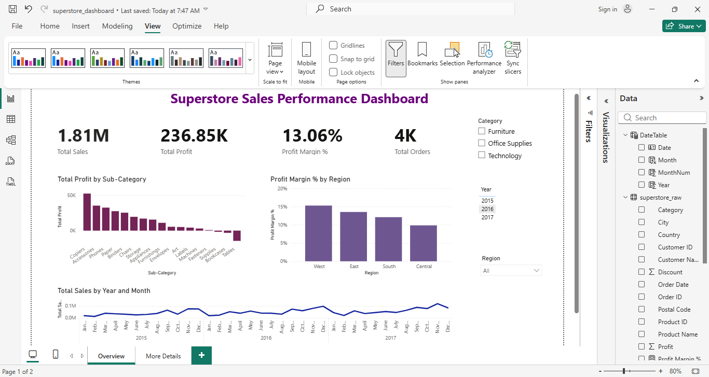
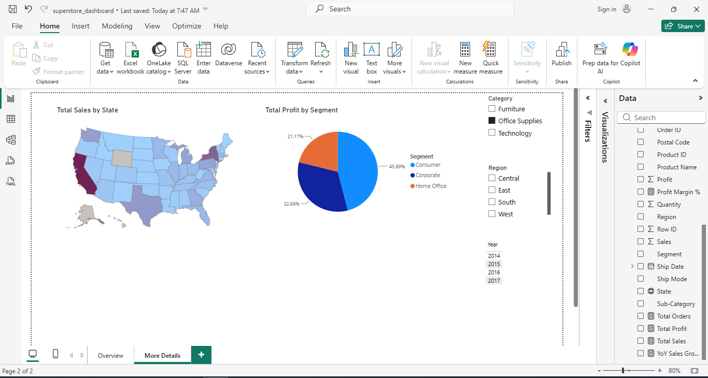
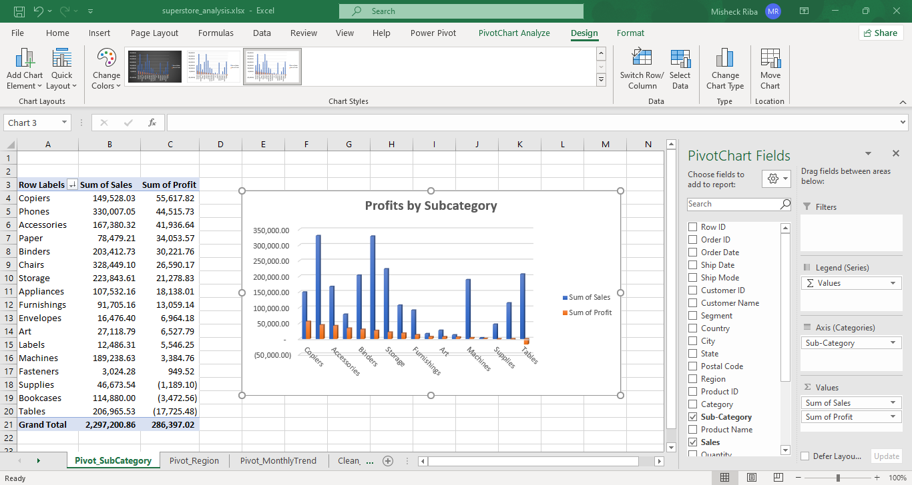
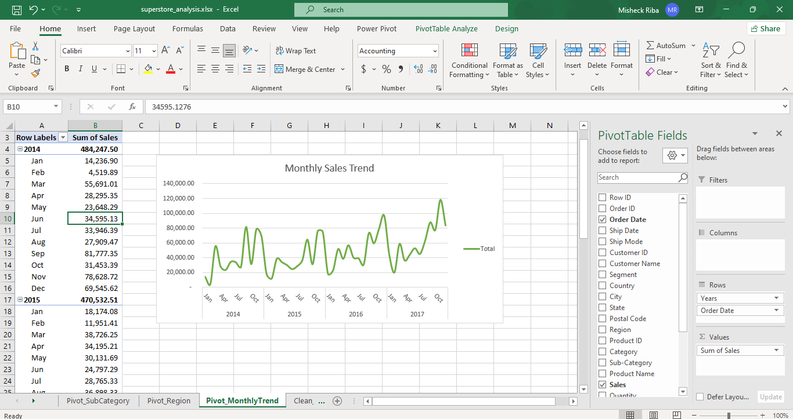
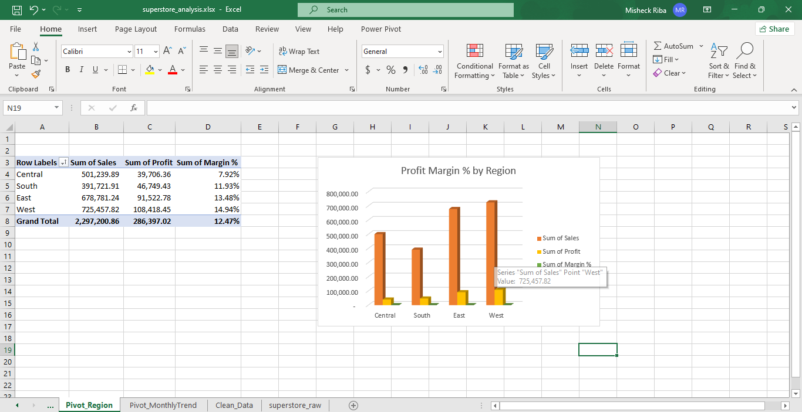

# Retail Sales Performance Analysis

## Overview

An end-to-end analysis of Superstore retail sales data using SQL, Excel,
and Power BI to identify profitability drivers and underperforming segments
across regions, categories, and discount levels.

## Business Questions

1. Which product categories/sub-categories are most and least profitable?
2. Which regions underperform in terms of profit margin?
3. Does higher discounting reduce or eliminate profit — and is this worse
   in specific categories like Furniture?
4. Are there seasonal or monthly sales trends across the dataset?
5. Which customer segment (Consumer, Corporate, Home Office) drives the
   most revenue and profit?

## Tools Used

- **SQL** (SQLite) — data querying and business question analysis
- **Excel** — data cleaning, pivot tables, ad-hoc analysis
- **Power BI** — interactive dashboard and visualization

## Dataset

[Superstore Sales Dataset](https://www.kaggle.com/datasets/vivek468/superstore-dataset-final)
— 9,994 retail orders (2014–2017), including order details, customer
segment, product category, sales, discount, and profit for each line item.

## Process

1. **Data understanding** — reviewed structure, checked date formats,
   confirmed one Order ID can span multiple product line items, and
   spotted an early signal that high discounts correlate with negative
   profit (e.g. a Furniture order with 45% discount resulted in a $383 loss).
2. **SQL analysis** (see `/sql`) — queried the dataset across 5 dimensions
   (sub-category, region, discount level, monthly trend, customer segment)
   using SQLite to identify profitability drivers. Confirmed that discounting
   is the single biggest lever affecting profit across the business.
3. **Excel analysis** (see `/excel`) — cleaned the dataset (verified data
   types, checked for blanks/duplicates — none found), added calculated
   columns for Shipping Days and Discount Band, and built 3 pivot tables
   with charts (Sub-Category profitability, Regional margin, Monthly
   trend) with conditional formatting to flag loss-making orders. All
   figures cross-validated against SQL results with an exact match.
4. **Power BI dashboard** (see `/powerbi`) — built a 2-page interactive
   dashboard with a custom date dimension table and 5 DAX measures
   (Total Sales, Total Profit, Profit Margin %, Total Orders, YoY Sales
   Growth %). The Overview page features KPI cards, a Sub-Category profit
   chart, Regional margin comparison, and a monthly sales trend line; the
   Details page includes a filled map of sales by state. Both pages are
   fully interactive with Region, Category, and Year slicers.

## Key Insights

- **Discounting is the biggest profit lever**: orders discounted above 20%
  are unprofitable on average, and the 933 orders (9.3% of total) discounted
  40%+ lost the business nearly $100k combined.
- **Tables is the worst-performing sub-category**: $206,965.53 in sales but
  a **-$17,725.48 loss** (-8.56% margin) — likely driven by heavy discounting.
  Bookcases and Supplies are also unprofitable.
- **Central region underperforms**: lowest profit margin (7.92%) of all
  4 regions, despite solid sales volume — West leads at 14.94%.
- **Strong seasonality**: sales dip every January–February and peak every
  November–December, with an overall upward trend year-over-year (2017
  was the strongest year).
- **Consumer segment drives volume, not efficiency**: highest sales/profit
  in absolute terms, but the lowest margin (11.55%) of the three segments —
  Home Office is smaller but most profit-efficient (14.03%).
- **Consistent year-over-year growth**: total sales grew from $484,247.50
  (2014) to $733,215.26 (2017), with a strong acceleration in the final
  two years — 2016 and 2017 combined account for over 58% of total sales.

## Visual Highlights

### Power BI Dashboard

### Excel Pivot Charts

## Summary

This project demonstrates a full analytics workflow — from raw data to
business insight — using three of the most common tools in a data
analyst's toolkit. Key findings consistently pointed to **discounting
strategy** as the biggest controllable driver of profitability: orders
discounted above 20% are unprofitable on average, this pattern is
concentrated in specific sub-categories (Tables, Bookcases) and the
Central region, and correcting it represents a clear, quantifiable
opportunity (~$135k in combined losses from Medium/High discount bands
alone) without needing any new sales volume.

All figures were cross-validated across SQL, Excel, and Power BI to
confirm consistency across tools.
